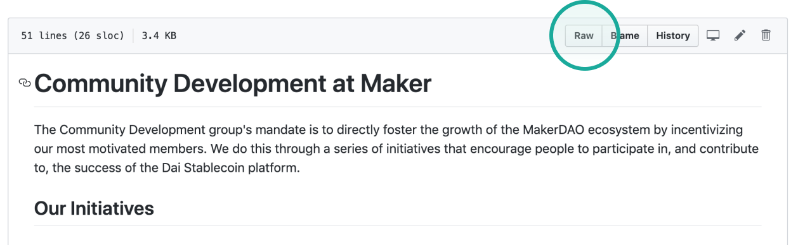
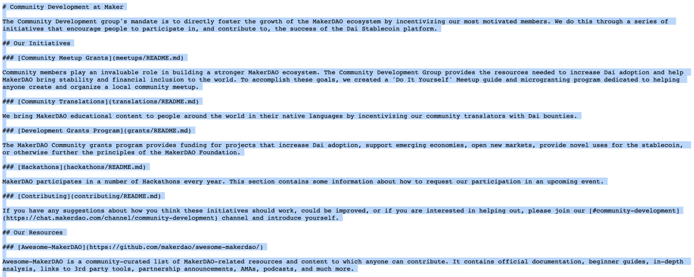

# The translation process


**Translator applications are currently open!**


## 1. Wait to receive your task

The project co-ordinator will send you a task once your application has gone through.

## 2. Get started in GitHub

Go to the GitHub documents list and select the assigned page.

[Community GitHub ↗](https://github.com/makerdao/community)


If you're editing a page like "Translations" which is its own folder, you'll find the content in **`README.md`**


Press “raw”, select all and copy-to-clipboard.

## 3. Translate in Markdown

You need to write the translation in markdown. We recommend an editor like HackMD or VScode.

* [HackMD ↗ ](https://hackmd.io/)
* [VSCode ↗](https://code.visualstudio.com/)


Feel free to use any software that helps find translation errors and improve writing. We encourage using tools that assist workflow. Copying from a program will disqualify you from receiving a bounty and from future assignments. Please use them as an aide and not a substitute for your work.


If you need help, reach out to us in the [translation chat ↗](https://chat.makerdao.com/channel/translation)

### On blockchain terminology

The blockchain space is relatively new. Various languages are slowly developing terms to match the English vocabulary. Other community members may be able to help if they’ve already translated specific terminology.

We also have glossaries that might help.









## 4. Forward to your project coordinator

Forward your `.md` file to the project coordinator for review. Make sure you keep its original name, like `dai.md`

The project coordinator will get back to you with any feedback or amendments. Make any changes you need and forward again.

## 5. Collect your bounty

If everything is good with the translation, the project coordinator will publish your work and let you know how to get your bounty.


Need help at any time? We’ve created a dedicated channel. [Translations chat ↗](https://chat.makerdao.com/channel/translation)


## Helpful resources

### Writing style guide

Get the details right. Follow the writing standards for Maker.



